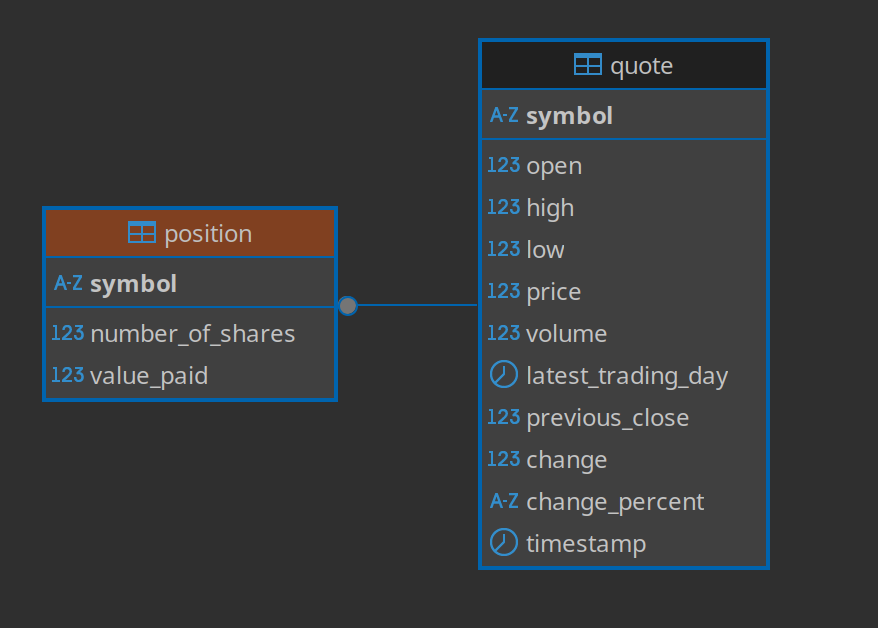

# Introduction

The Stock Quote Application is a console-based program that retrieves real-time stock market data and 
manages user positions. Users can fetch stock quotes, track their portfolio, and calculate the total value 
paid for shares automatically. The application is designed with modularity and scalability in mind, 
following best practices in software architecture. The app ensures smooth and reliable data management, 
making it a powerful tool for tracking, practicing, and managing stock investments in a real-world-like 
environment, without any risks. 

This project utilizes several key technologies:

- Java: Core programming language for Implementation.

- JDBC: Java Database Connectivity (JDBC) is used to interact with the PostgreSQL database.

- PostgreSQL (PSQL): Relational database for storing stock data and user positions.

- Maven (MVN): Dependency management and project build tool.

- Docker: Containerization of the application for easy deployment and consistency across environments.

- Logback: Logging framework for tracking application flow and error handling.

- OkHttpClient & Jackson: HTTP client and JSON processing libraries for API requests and responses.

- Alpha Vantage: REST API used to get access to up to date stock quotes informations.

# Implementation
## ER Diagram

## App usage

To use the Stock Quote application, follow these steps:

### 1) Use Docker

- Make sure you have Docker installed on your system.

- Pull the Docker image: 

        docker pull aelatris/stockquote

- Ensure your PostgreSQL database is running and accessible. (Please refer to the second section: **Setup PostgreSQL**)

- Run the application in interactive mode with host connectivity: 

        docker run --name postgres-container -e POSTGRES_USER=postgres -e POSTGRES_PASSWORD=password -p 5432:5432 -d postgres
    
    ***docker run***: 
    - Tells Docker to start and run a container.

    ***-it***: Combines two options:

    - i: Keeps the container running in the background, allowing interaction.
    - t: Allocates a terminal so you can interact with the container (like opening a command prompt).

    ***--add-host=host.docker.internal:host-gateway***: 
    - Adds a special entry to the container's internal host file, allowing the container to refer to the host machine using host.docker.internal.
    
    ***aelatris/stockquote***: Specifies the name of the Docker image you want to run, which in this case is **aelatris/stockquote**.

    in simple terms, this command runs the aelatris/stockquote Docker image, allows you to interact with it in the terminal, and gives it a way to access your host machine using host.docker.internal.

- The application menu will appear, allowing you to:
    1. Get Stock Info
    2. Get Position Info
    3. Buy Stock
    4. Sell Stock
    5. View Portfolio
    6. View available Quotes
    7. Add a new Quote
    8. Update a Quote
    9. Exit
    
- Follow the on-screen prompts to navigate through the application's features.

- Select option 9 to exit the application when finished.

**Note: This application requires a connection to a PostgreSQL database.**

### 2) Setup PostgreSQL

- Make sure you have Postgres installed on your system.

- Create a PostgreSQL container, make sure to set the username as **postgres** and the password as 
**password**.
    Here is an example:

        docker run --name postgres-container -e USER=postgres -e PASSWORD=password -p 5432:5432 -d postgres

- Connect to your postgres container.

        psql -h localhost -U postgres -W

- Use the Database_setup.sql file that is in the projects stockquote directory. It contains the sql code
  you need to Create the database **stock_quote** and the tables **quote** and **position**.

***Note: Before running the application, ensure Docker is running and you have a valid Docker image. 
You can check by running "docker ps" to confirm that your PostgreSQL container is up and running.***

## Design Patterns
The application follows the DAO (Data Access Object) and Repository design patterns to ensure separation of 
concerns and maintainability.

- DAO Pattern: The DAO layer abstracts the database interactions, providing CRUD operations for stock 
quotes and user positions. This pattern allows for flexibility in database management and makes it 
easier to switch to another database if needed.

- Repository Pattern: The repository pattern acts as an intermediary between the DAO layer and business 
logic. It encapsulates query logic and ensures efficient data access while keeping the service layer 
clean and maintainable.
# Test

- Database Setup: To make sure that the connection is always good, I implemented validation using OkHttpClient in my code.

- Test Data: Sample stock quotes and user positions are inserted into the database for validation.

- Query Validation: Test cases confirm that stock quotes are retrieved accurately and position values are computed correctly.

- Logging & Debugging: Logback is used to track the application's flow and identify issues during execution.

- JUnit & Mockito: 
  - **JUnit** is used for writing unit tests, ensuring that each component behaves as expected.  
  - **Mockito** is used for mocking dependencies, allowing isolated testing of components that interact with external services or databases. For example, DAO methods that interact with the database are tested using mocked data instead of executing real queries.  

- Integration Tests: These tests validate end-to-end interactions between components, ensuring that stock data retrieval, storage, and updates function correctly.  