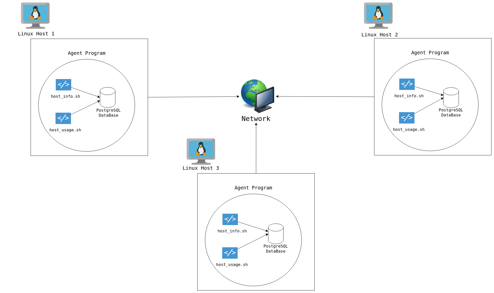

# Introduction
This project is designed to monitor and manage hardware resources across multiple Linux hosts by collecting hardware 
specifications and usage metrics. The primary users are the Jarvis Linux Cluster Administration, who will use the 
collected data to generate reports for future planning and resource allocation.

The project stores the gathered information in a PostgreSQL database, allowing for easy analysis through SQL queries. 
Key technologies used include Bash scripting for automation, Docker for containerization, and Regex for filtering important data. 
Version control is handled with Git, and crontab is used for scheduling periodic data collection. The design focuses on modularity 
and efficiency to ensure the system is scalable and maintainable.

# Quick Start
```bash
# Start a PostgreSQL instance using psql_docker.sh
./scripts/psql_docker.sh start

# Create the necessary database tables using ddl.sql
psql -h localhost -U postgres -d host_agent -f sql/ddl.sql

# Insert hardware specs data into the database
./scripts/host_info.sh psql_host psql_port db_name psql_user psql_password

# Insert hardware usage data into the database
./scripts/host_usage.sh psql_host psql_port db_name psql_user psql_password

# Set up crontab for periodic data collection
crontab -e
# Add the following entry to collect data every minute
* * * * * bash /path/to/scripts/host_usage.sh psql_host psql_port db_name psql_user psql_password >  /tmp/host_usage.log
# You can find it in the crontab job list
crontab -l
```

# Implementation

## Architecture


- PostgreSQL Database (psql): This is the central component for data persistence. 
All the information collected by the agent programs is stored in this database.

- Agent Program: The agent is composed of two bash scripts:

  - host_info.sh: This script gathers hardware information about the host and inserts the 
  data into the database. It is executed only once.
  - host_usage.sh: This script collects real-time usage data and regularly inserts this data 
  into the database. It's scheduled to run every minute, using cron.
## Scripts

### psql_docker.sh
Manages the lifecycle of a PostgreSQL Docker container.
```bash
# Start PostgreSQL instance
./scripts/psql_docker.sh start

# Stop PostgreSQL instance
./scripts/psql_docker.sh stop

# Create PostgreSQL container
./scripts/psql_docker.sh create
```

### host_info.sh
Collects static hardware specifications, such as CPU model and total memory, and inserts them into the database.
```bash
# Execute script
./scripts/host_info.sh psql_host psql_port db_name psql_user psql_password
```

### host_usage.sh
Collects real-time hardware usage metrics, including CPU and memory utilization, and inserts them into the database.
```bash
# Execute script
./scripts/host_usage.sh psql_host psql_port db_name psql_user psql_password
```

### crontab
Schedules the `host_usage.sh` script to run every minute, ensuring continuous data collection.
```bash
# Open crontab
crontab -e

# Add the following entry for minute-based data collection
* * * * * bash /path/to/scripts/host_usage.sh psql_host psql_port db_name psql_user psql_password > /tmp/host_usage.log

# You can see it in the crontab job list
crontab -l
```

### queries.sql
Contains SQL queries to resolve business problems, such as identifying underutilized resources and analyzing hardware performance trends.
```sql
-- Example query: Find servers with low CPU utilization
SELECT * FROM host_usage WHERE cpu_usage < 20;
```

## Database Modeling

### `host_info` Table Schema

| Column            | Data Type               | Nullable | Default                                     | Explanation |
|-------------------|-------------------------|----------|---------------------------------------------|-------------|
| `id`              | SERIAL                  | not null | Auto-incrementing                           | A unique identifier for each host. This is the primary key of the table and is automatically generated. |
| `hostname`        | VARCHAR                 | not null |                                             | The name of the host. It must be a unique string. |
| `cpu_number`      | smallint                | not null |                                             | The number of CPU cores on the host. This gives an idea of the host's processing power. |
| `cpu_architecture`| VARCHAR                 | not null |                                             | The architecture of the CPU. It helps to identify the type of processor. |
| `cpu_model`       | VARCHAR                 | not null |                                             | The model of the CPU. This gives more detailed information about the processor. |
| `cpu_mhz`         | FLOATS                  | not null |                                             | The clock speed of the CPU in MHz, providing an indication of how fast the CPU operates. |
| `l2_cache`        | integer                 | not null |                                             | The size of the L2 cache. L2 cache is a type of memory used by the CPU to speed up access to frequently used data. |
| `timestamp`       | timestamp               | optional |                                             | The timestamp when the host information was recorded. This allows for tracking of when the information was updated. |
| `total_mem`       | integer                 | optional |                                             | The total amount of memory available on the host, typically in kilobytes. |

### `host_usage` Table Schema

| Column            | Data Type               | Nullable | Default | Explanation |
|-------------------|-------------------------|----------|---------|-------------|
| `timestamp`       | timestamp               | not null |         | The timestamp when the host usage data was recorded. This helps in tracking the state of the system at a specific time. |
| `host_id`         | SERIAL                  | not null |         | A foreign key that references the `id` of the `host_info` table. This ties the usage data to a specific host. |
| `memory_free`     | integer                 | not null |         | The amount of free memory on the host. It indicates how much of the total memory is not in use. |
| `cpu_idle`        | smallint                | not null |         | The percentage of CPU time that is idle. It indicates how much unused CPU capacity the system has at the moment. |
| `cpu_kernel`      | smallint                | not null |         | The percentage of CPU time spent on kernel tasks. It helps to understand how much of the CPU is occupied by system-level operations. |
| `disk_io`         | integer                 | not null |         | The amount of disk I/O operations. This is useful for monitoring disk activity and performance. |
| `disk_available`  | integer                 | not null |         | The amount of available disk space in kilobytes. It indicates how much storage capacity is left on the host's disk. |

### Explanation of the Relationship

- **`host_info` Table**: This table stores information about the host's hardware, like CPU and memory.
 
 
- **`host_usage` Table**: This table stores data about the host's usage, such as CPU usage, memory, and disk space over time.

The two tables are connected by the host_id in the host_usage table, which refers to the id in 
the host_info table. This links usage data to the specific host.

# Test
To test my scripts, I ran them on my Linux instance and verified the outcomes by checking the database to ensure everything 
was created correctly. In case of any issues, I debugged the scripts using methods such as:

- Inserting echo commands into the scripts to print variable values and trace the flow of 
execution.
 

- Using the bash -x command to run scripts with detailed debugging output.


**The results were as follows:**

- ddl.sql: Successfully created the required database schema without errors.
 

- host_info.sh: Accurately populated the host_info table with static hardware data.
 

- host_usage.sh: Successfully captured and stored real-time usage metrics. The script ran every minute, and the logs confirmed error-free operation.

# Deployment
The deployment process includes the following steps:
- **Version Control**: Hosting the bash scripts and other files on GitHub, ensuring easy version control, collaboration, and access for future updates.
 

- **PostgreSQL Container**: Setting up a PostgreSQL instance within a Docker container to ensure a consistent and portable deployment environment across different systems.
 

- **Automated Data Collection**: Using `crontab` to schedule the execution of the `host_usage.sh` script at regular intervals (every minute) for automated collection of real-time system metrics, such as CPU, memory, and disk usage.


# Improvements
1. **Dynamic Hardware Updates**: Enhance `host_info.sh` to update existing hardware configurations automatically.
2. **Data Visualization**: Integrate visualization tools like Grafana for better trend analysis and monitoring.
3. **Historical Data Cleanup**: Implement a cleanup mechanism to archive or delete old usage data to optimize database performance and storage.
4. **Robust Error Handling**: Implement detailed logging and error handling in scripts for improved reliability.
