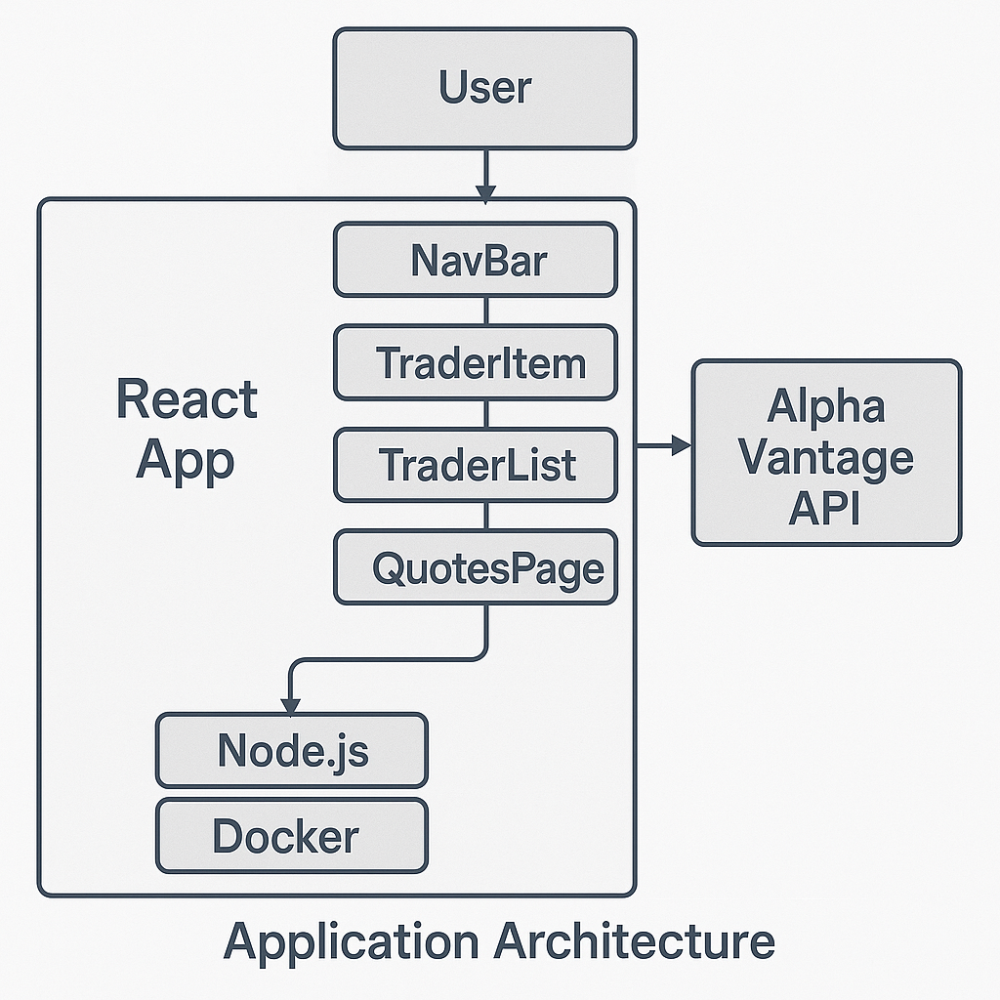

# Introduction
This project is a trading application built with React. It includes a Dashboard page that displays user (trader) profiles and a Quotes page that shows daily stock data. The stock quotes are fetched live from the Alpha Vantage public API, ensuring the data is always current and reliable.

The app uses Axios for API requests and Node.js for building and running the project in a development environment. Git was used throughout the project for version control and to keep track of changes during development.

The layout and components are styled using Ant Design, a popular React UI library that provides ready-to-use and responsive components like tables, forms, and buttons. This helped speed up development and keep the design consistent across pages.

Overall, this project demonstrates how to create a simple and functional trading interface with real-time data and a clean UI using modern web development tools.

# Quick Start

#### 1. Clone the Repository

    git clone https://github.com/jarviscanada/jarvis_data_eng_AdhamElatris.git

    and go to the React folder

#### 2. Install Dependencies
Make sure you have Node.js and npm installed.

    npm install

#### 3. Start the app using Node.js (Option 1)

    npm start

#### 4. Start the app using Docker (Option 2)

    docker-compose up --build

    The app will be available here:  http://localhost:3000

# Implemenation
The trading application is built using React for the frontend, with component-based architecture to maintain a modular and scalable structure. The UI leverages Ant Design for a modern and responsive user interface.

Key components include:

- NavBar: For navigation across pages.

- TraderItem: Represents individual trader data.

- TraderList: Displays all traders in a tabular format.

- Dashboard: The homepage showing user/trader information.

- QuotesPage: Fetches and displays real-time stock quotes.

Real-time stock data is retrieved from the Alpha Vantage API using Axios. The API integration is handled inside the QuotePage component, which sends HTTP requests to fetch daily quotes for stocks like AAPL, TSLA, and GOOGL.

The project is containerized using Docker, making it easy to set up and run in any environment. The React app is served using a lightweight Node.js HTTP server inside the Docker container.

Version control and collaboration were managed with Git, ensuring consistent development and easy rollback.
## Architecture

# Test
The application was tested manually, with each component undergoing multiple rounds of testing to ensure stability and eliminate potential bugs.

# Deployment
The application's codebase was version-controlled using Git. A fully functional version of the app was containerized and deployed using Docker, ensuring consistent and reliable execution across different environments.

# Improvements
- handle Quote adding/removing etc.
- Adding a database for users and users activity
- Integrate an Alpha Vantage subscription key to increase API rate limits and ensure more reliable, real-time data access without interruptions.

